# 👋 Sup, ¡Yere de este lado!

> Desarrollador de software enfocado en crear soluciones de alto impacto, con formación en Desarrollo de Aplicaciones Informáticas y experiencia práctica en proyectos reales y reconocidos a nivel nacional. He trabajado con tecnologías modernas en frontend y backend, participando en iniciativas como la NASA Space Apps Challenge y desarrollando productos utilizados por usuarios reales. Apasionado por la arquitectura de software, el aprendizaje continuo y la construcción de herramientas que resuelven problemas reales. 

  

  

---

## 💻 Habilidades Técnicas
<table>
  <tr>
    <td>
      
    </td>
    <td>
      <table>
        <tr>
          <th>Área</th>
          <th>Tecnologías</th>
        </tr>
        <tr>
          <td>Frontend</td>
          <td>Angular TS, Astro, React Vite TS, Tailwind CSS, Bootstrap</td>
        </tr>
        <tr>
          <td>Backend</td>
          <td>Node.js, FastAPI, Google Firebase</td>
        </tr>
        <tr>
          <td>Bases de Datos</td>
          <td>MySQL, SQL Server, PostgreSQL</td>
        </tr>
        <tr>
          <td>Aplicaciones de Escritorio</td>
          <td>WinForms (C#)</td>
        </tr>
        <tr>
          <td>Otros Lenguajes</td>
          <td>C++, Python</td>
        </tr>
      </table>
    </td>
  </tr>
</table>

---

## 📂 Certificaciones

- **Asistente Web** *(Fundación Carlos Slim, Capacítate para el Empleo)*
- **Visualizador de Datos** *(Fundación Carlos Slim)*
- **Desarrollador de Sitios Web Responsivos** *(Fundación Carlos Slim)*
- **Programador en C#** *(Fundación Carlos Slim)*
- **Técnico en Informática (Ofimática)** *(Fundación Carlos Slim)*
- **Desarrollador de JavaScript (Node.js)** *(Fundación Carlos Slim)*
- **Desarrollador de JavaScript (React)** *(Fundación Carlos Slim)*
- **Galactic Problem Solver** *(Nasa Internacional Space Apps Challenge)*
- **ISO 27001 Information Security Management Systems Certified** *(Seguridad Cero)*
- **API Beginner Path** *(Postman)*

---

## 🏆 Proyectos Destacados

- **ATS (Attendance Tracking System)**
  - Reconocido por el Ministerio de Educación de República Dominicana.
  - Sistema de control de asistencia estudiantil automatizado.

- [**Awesome Linktree**](https://github.com/yerepf/awesome-linktree)
  - Proyecto de código abierto creado con Astro que permite generar páginas estilo Linktree personalizables usando archivos Markdown.
  - Facilita la gestión de enlaces personales o profesionales (GitHub, redes, portafolios, proyectos) en una única página compilada automáticamente.

- [**Quisqueya STEM**](https://quisqueya-stem.vercel.app/) :boom: **150 usuarios en 15 Dias**
  - Plataforma web desarrollada para que cualquier dominicano pueda descubrir y compartir certificaciones STEM gratuitas.
  - Promueve el aprendizaje accesible en ciencia, tecnología, ingeniería y matemáticas, centralizando en un solo lugar oportunidades educativas disponibles en línea.

- [**C.R.A.S.H**](https://crashnasa.earth) :rocket: **Mejor uso de la data**
  - Aplicación creada durante la hackathon de la NASA para el mejor uso de la data, enfocada en el análisis de trayectorias de asteroides cercanos a la Tierra.
  - Permite visualizar, simular y comprender los riesgos potenciales de impacto, utilizando datos reales de la NASA de manera interactiva y educativa.

- [**Sitio web para el Centro de Enseñanza Las Joyas de Cristo**](https://lasjoyasdecristo.netlify.app/)
  - Desarrollo integral, diseño responsivo y funcionalidades personalizadas.

- **Sistema de Facturación para PFTechnology**
  - Aplicación de escritorio en WinForms (C#) con generación de códigos de barra, facturas, reportes, escaneo móvil y envío de facturas por email.

---

## 💼 Experiencia

- **International Travel Exchange (ITEX)**
  - Pasantía como Asistente Corporativo (9 meses).
- **Banco Popular Dominicano**
  - Pasantía como Habilitador IT I (1 mes).

---

## 🌐 Idiomas

- Español (Nativo)
- Inglés (B2)

---

## 🤖 Fun Facts & Hobbies

- Inicié en el mundo de la tecnología creando videojuegos en Scratch.
- Toco batería en la iglesia
- Soy deportista, practico voleibol.
- Mi PB resolviendo el cubo de rubik 3x3x3 es de 19.72s

---

## 📫 Conecta conmigo

[Portfolio](https://yere.my)
[LinkedIn](https://www.linkedin.com/in/yeremy-yael-pujols-f%C3%A9lix-a34271340/)
[Otros enlaces](linktree.yere.my)

---

_¡Gracias por visitar mi perfil!_
