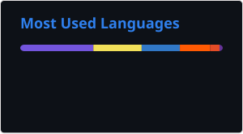

<h1 align="center">Sup, Yere here! </h1>

> Software Developer focused on building high-impact solutions, with a background in Software Application Development and hands-on experience working on real-world projects recognized at the national level. I've worked with modern frontend and backend technologies, participated in initiatives such as the NASA Space Apps Challenge, and built products used by real users. Passionate about software architecture, continuous learning, and building tools that solve real-world problems.

  

  

---

## 💻 Technical Skills

<table>
  <tr>
    <td>
      
    </td>
    <td>
      <table>
        <tr>
          <th>Area</th>
          <th>Technologies</th>
        </tr>
        <tr>
          <td>Frontend</td>
          <td>Angular TS, Astro, React Vite TS, Tailwind CSS, Bootstrap</td>
        </tr>
        <tr>
          <td>Backend</td>
          <td>Node.js, FastAPI, Google Firebase</td>
        </tr>
        <tr>
          <td>Databases</td>
          <td>MySQL, SQL Server, PostgreSQL</td>
        </tr>
        <tr>
          <td>Desktop Applications</td>
          <td>WinForms (C#)</td>
        </tr>
        <tr>
          <td>Other Languages</td>
          <td>C++, Python</td>
        </tr>
      </table>
    </td>
  </tr>
</table>

---

## 📂 Certifications

* **IT Essentials** *(Cisco Networking Academy)*
* **C++ Essentials 1** *(Cisco Networking Academy)*
* **Cybersecurity Fundamentals** *(Google - Coursera)*
* **Web Assistant** *(Carlos Slim Foundation, Capacítate para el Empleo)*
* **Data Visualizer** *(Carlos Slim Foundation)*
* **Responsive Website Developer** *(Carlos Slim Foundation)*
* **C# Programmer** *(Carlos Slim Foundation)*
* **Computer Technician (Office Applications)** *(Carlos Slim Foundation)*
* **JavaScript Developer (Node.js)** *(Carlos Slim Foundation)*
* **JavaScript Developer (React)** *(Carlos Slim Foundation)*
* **Galactic Problem Solver** *(NASA International Space Apps Challenge)*
* **ISO 27001 Information Security Management Systems Certified** *(Seguridad Cero)*
* **API Beginner Path** *(Postman)*

---

## 🏆 Featured Projects

* **ATS (Attendance Tracking System)**

  * Recognized by the Ministry of Education of the Dominican Republic.
  * Automated student attendance tracking system.

* [**Awesome Linktree**](https://github.com/yerepf/awesome-linktree)

  * Open-source project built with Astro that allows users to generate customizable Linktree-style pages using Markdown files.
  * Makes it easy to manage personal or professional links (GitHub, social media, portfolios, projects) on a single automatically generated page.

* [**Quisqueya STEM**](https://quisqueya-stem.vercel.app/) :boom: **150 users in 15 days**

  * Web platform built to help anyone in the Dominican Republic discover and share free STEM certifications.
  * Promotes accessible learning in science, technology, engineering, and mathematics by centralizing online educational opportunities in one place.

* [**C.R.A.S.H**](https://crashnasa.earth) :rocket: **Best Use of Data**

  * Application developed during the NASA Space Apps Challenge, focused on analyzing near-Earth asteroid trajectories.
  * Allows users to visualize, simulate, and understand potential impact risks using real NASA data in an interactive and educational way.

* [**Website for Las Joyas de Cristo Educational Center**](https://lasjoyasdecristo.netlify.app/)

  * Full website development, responsive design, and custom functionality.

* **PFTechnology Billing System**

  * Desktop application built with WinForms (C#), featuring barcode generation, invoicing, reporting, mobile scanning, and email invoice delivery.

---

## 💼 Experience

* **International Travel Exchange (ITEX)**

  * Corporate Assistant Intern (9 months).
* **Banco Popular Dominicano**

  * IT Enabler I Intern (1 month).

---

## 🌐 Languages

* Spanish (Native)
* English (B2)

---

## 🤖 Fun Facts & Hobbies

* I got into technology by creating video games with Scratch.
* I play drums at church.
* I'm into sports and play volleyball.
* My personal best solving a 3x3x3 Rubik's Cube is **19.72s**.

---

## 📫 Connect With Me

[Portfolio](https://yere.my)
[LinkedIn](https://www.linkedin.com/in/yeremy-yael-pujols-f%C3%A9lix-a34271340/)
[Other Links](https://linktree.yere.my)

---

*Thanks for visiting my profile!*
